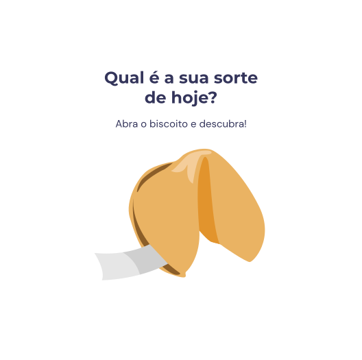

<h1 align="center">Jogo biscoito da sorte</h1>

 O jogo consiste em mostrar uma mensagem de sorte ao usuário, cada vez que ele jogar, ou seja clicar no botão lhe será mostrado uma mensagem aleatória 

   

  <a href="#-tecnologias">Tecnologias</a>&nbsp;&nbsp;&nbsp;|&nbsp;&nbsp;&nbsp;
  <a href="#-projeto">Projeto</a>&nbsp;&nbsp;&nbsp;|&nbsp;&nbsp;&nbsp;
  <a href="#-layout">Layout</a>&nbsp;&nbsp;&nbsp;|&nbsp;&nbsp;&nbsp;
  <a href="#memo-licença">Licença</a>

  

 

  

## 🚀 Tecnologias

Esse projeto foi desenvolvido com as seguintes tecnologias:

- HTML
- CSS
- JavaScript
- Git e Github
- Figma

## 💻 Projeto

Link do projeto finalizado . -[Visite o projeto online])

Esse projeto está sob a licença MIT.

---
